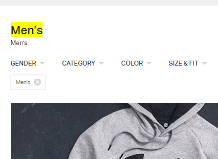
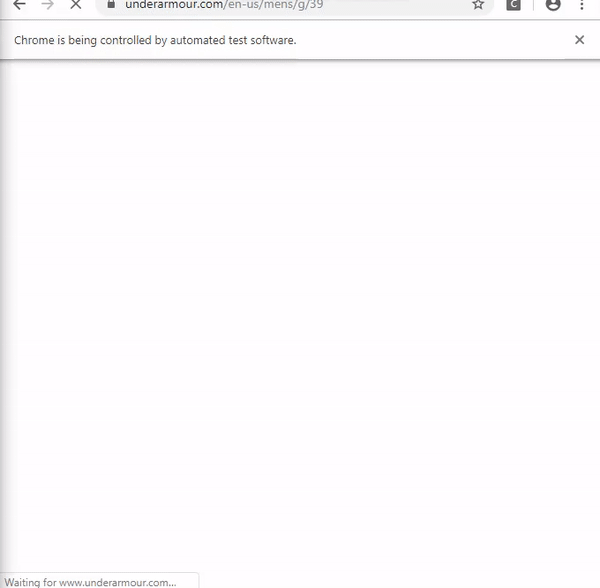

```{r global_options, include=FALSE}
knitr::opts_chunk$set(
  warning = FALSE,
  message = FALSE,
  fig.align = "center"
)
?knitr::opts_chunk
```
This is an exploration of how to web-scrape in R. We will use Underarmour's US 
website to demonstrate how we can parse through a web page and pull data we 
are interested in. In particular we'll be looking at their *Shop All Men's* page, 
found [**HERE**](https://www.underarmour.com/en-us/mens/g/39).  

Let's begin by loading the relevant libraries.
```{r results = "hide"}
library(rvest)
library(dplyr)
library(stringr)
```
`rvest` is *the* library for handling HTML and XML documents in R, and `dplyr` has 
many convenience functions for data science, in particular the pipeline operator 
`%>%` from `magrittr`. We'll begin by reading the web page.

```{r results = "hide"}
ua <- read_html("https://www.underarmour.com/en-us/mens/g/39")
```
We can explore the webpage for basic items. For example if we wanted to see all 
the `<h1>` tags and what their values are, we could try the following:  

```{r}
ua %>%
  html_nodes("h1") %>%
  html_text()
```
ie: There is only one header tag `<h1>` in the page, and it say's *Men's*. We can 
see it here:  

```{r, echo=FALSE}

```
Or if we wanted to investigate list items `<li>`, we can try the following: (**Note:** 
only display a few of the results at a time otherwise RStudio will explode)

```{r}
ua %>%
  html_nodes("li") %>%
  html_text() %>%
  .[c(1:2,4:6)]
```
Now let's focus our analysis. Suppose we wanted to pull information on every item 
on the page. Depending on when you're viewing the website, the number of items will 
vary but it is typically between 1400 - 1500. We want to pull the SKU or product ID, 
the product title, the product subtitle (usually article of clothing), and the price. 
In order to do this we'll need to inspect the page (`ctrl` + `shift` + `I`). We see 
that the product title is usually given the class "title".

```{r}
# Product title - first attempt.
title <- ua %>%
  html_nodes("div") %>%
  html_nodes(".title") %>%
  html_text()
title[(length(title)-10):length(title)]
```
We see that we are pulling the product titles but we're also pulling the product 
sub-titles at the same time. This is because sub-titles are also in the "title" 
class and additionally the "sub" class.

```{r}
# Product title - second attempt.
title <- ua %>%
  html_nodes("div") %>%
  html_nodes(".title:not(.sub)") %>%
  html_text()
title[(length(title)-10):length(title)]
```
This looks much better. We use similar code to find the subtitle, the product ID, 
and the price.

```{r}
# Product subtitle
subtitle <- ua %>%
  html_nodes("div") %>%
  html_nodes(".title.sub") %>%
  html_text()
subtitle[(length(subtitle)-10):length(subtitle)]
```
```{r}
# Product price
px <- ua %>%
  html_nodes("div") %>%
  html_nodes(".price-detail") %>%
  html_text()
px[(length(px)-10):length(px)] 
```
```{r}
# Product ID / SKU
pid <- ua %>%
  # This is an xpath selector to choose an ATTRIBUTE value
  xml_find_all("//@data-pid") %>%
  html_text() %>%
  as.integer()
pid[(length(pid)-10):length(pid)]
```
Each of these items is contained in a character vector. Let's confirm that they're 
all the same length.
```{r}
c(length(pid), length(title), length(subtitle), length(px))
```
They are the same length, but only 60 elements in each vector? Doesn't it list 
1400+ ? If you scroll through the page you'll find out that once you reach the 
bottom, the website dynamically loads more elements -- they're not loaded all at 
once. This is referred to as an **Infinite Scroll** and it's something we'll have 
to deal with before we can read all the HTML tags from the website.  
```{r}
df <- cbind(pid, title, subtitle, px)  %>%
  as.data.frame()
head(df)
```
 **Side note:** Even though all the vectors are of equal length here, it is not 
guaranteed to happen. In particular, some items do not have a *subtitle*, think 
gift cards and gift boxes. Ultimately we would like to bind these vectors together 
to form a dataframe but this won't be possible if the vectors all have slightly 
different lengths. Something to keep in mind.

## The Infinite Scroll
From the [**Selenium**](https://www.seleniumhq.org/) website,
```{r include=FALSE}
```
> Selenium is a suite of tools specifically for automating web browsers.  

We'll use the R implementation `RSelenium` to help deal with the infinite scroll. 
The idea will be to open the web page and automate the scrolling: scroll to the 
bottom of the page, wait for new items to load, and scroll to the bottom of the 
page again and repeat this process until every item is shown. Then we read the 
html with `rvest`.
```{r results="hide"}
library(RSelenium)
```
```{r results = "hide"}
rD <- rsDriver(browser=c("chrome"), chromever = "77.0.3865.40")
remDr <- rD[["client"]]
remDr$navigate("http://www.underarmour.com/en-us/mens/g/39/")
```
The following will open up a chrome browser and navigate to the Shop All Men's 
webpage. Two annoying pop-ups show up so let's take care of those.

```{r results = "hide"}
# Close the "How Do You Want to Shop" BUtton
popup <- remDr$findElement(using = 'css selector', 
                           "div.modal-dialog button")
popup$clickElement()
# Wait 2 seconds
Sys.sleep(2)
# Close the newsletter popup
# notice: It's the exact same code!!
popup2 <- remDr$findElement(using = 'css selector', 
                            "div.modal-dialog button")
popup2$clickElement()
```
We could use a `while` loop for the automated scrolling, but I'm going to use a 
`for` loop in case any strange, unexpected behaviour happens. The web page loads 
new items in batches of 60, so everytime you scroll to the bottom 60 new items 
are loaded. If there are 1500 items total, and 60 are displayed by default, then 
it should take no more than 24 iterations to scroll to the *very* end and exhaust all 
the items. After every iteration we take a measurement of the `scrollHeight` and compare 
it to the previous measurment -- if the two are the same than no new items have 
loaded (the page hasn't gotten any "taller") and the infinite scroll is finished 
and we break from the loop.
```{r eval = FALSE}
# Begin Scrolling
# Logic: Use a while loop that terminates once the scrollHeight doesn't change
# However: in practice this takes a *long* time - can it be done faster by 
# playing around with the Sleep time?
lastHeight <- remDr$executeScript("return document.body.scrollHeight")
for (i in c(1:30)){
  print(lastHeight)
  remDr$executeScript("window.scrollTo(0, document.body.scrollHeight);")
  Sys.sleep(5) # wait 5 seconds
  newHeight <- remDr$executeScript("return document.body.scrollHeight")
  if(newHeight[[1]] == lastHeight[[1]]){
    break
  }
  lastHeight = newHeight
}
ua3 <- remDr$getPageSource()
#save(ua3, file = "underarmour_webscraper/ua3_html.RData")
```
In practice, I've seen this code take half an hour to complete. I'm not entirely sure, but it looks like the UA website takes longer to load the more items are shown. Here's a demonstration of Selenium in action:  



I ran the code and saved the HTML on October 12, 2019. For convenience, I'll just use the data that I've previously saved.
```{r}
load("ua3_html.RData")
```
To illustrate what I said before about inconsistent html tagging, let's compare the 
*title* and *subtitle* data.

```{r}
title <- read_html(ua3[[1]]) %>%
  html_nodes("#grid-container") %>%
  html_nodes("div") %>%
  html_nodes(".title:not(.sub)") %>%
  html_text()

subtitle <- read_html(ua3[[1]]) %>%
  html_nodes("#grid-container") %>%
  html_nodes("div") %>%
  html_nodes(".title.sub") %>%
  html_text()

print(paste0("Length Title: ", length(title)))
print(paste0("Length Subtitle: ", length(subtitle)))
```
So it looks like 10 items do not have a subtitle. This is a problem if we intend 
to pull everything as a vector and then bind the columns together -- how can we 
bind columns of different lengths? (**Fraser:** This isn't a rhetorical question, 
I haven't found a better method for pulling several different elements from an HTML 
grid. If we could maintain an index (in this case 'tile-0', 'tile-1', 'tile-2', ...) 
we could perform a join afterwards, but I do not know how to pull html attributes and 
html text with the same selector.)  

My quick and dirty solution (dirty yes, quick... anything but) is to run a for-loop 
through each product, one at a time, and pull all the information on a per-product 
basis. If the selector doesn't find anything, input a missing value. In this way, 
we ensure that by the dataframe is filled in a consistent way. Unfortunately, the 
loop goes through one iteration per second, and with ~1500 items, we're looking at 
25 minutes for the code to complete. (The lesson here is to avoid any and all 
loops whenever you can, kids).

```{r}
# record the data_id attribute, we'll use this to help us loop through all the 
# products
data_id <- read_html(ua3[[1]]) %>%
  html_nodes("ul.tileset.stack-0") %>%
  html_nodes("li.tile") %>%
  html_attr("class") %>%
  str_extract_all("[0-9]+") %>%
  unlist() %>%
  as.integer()
max(data_id)
```

```{r}
# ready the dataframe. Since we know the dimensions beforehand, we can reserve 
# the memory and fill in the values iteratively.
df <- data.frame(matrix(NA, nrow = max(data_id) + 1, ncol = 4)) %>%
  mutate_if(is.logical, as.character)
colnames(df) <- c("product_id", 
                  "product_title", 
                  "product_subtitle", 
                  "product_px")
```

```{r eval = FALSE}
for (i in c(0:max(data_id))){
  print(i)
  tmp <- read_html(ua3[[1]]) %>%
    html_nodes(paste0("li.tile-",i))
  
  tmp_title <- tmp %>%
    html_nodes("div.title:not(.sub)") %>%
    html_text()
  
  tmp_subtitle <- tmp %>%
    html_nodes("div.title.sub") %>%
    html_text()
  
  # If nothing pulled for subtitle then input an NA
  if(length(tmp_subtitle) == 0){
    tmp_subtitle <- NA_character_
  }
  
  tmp_px <- tmp %>%
    html_nodes("div.price-detail") %>%
    html_text()
  
  tmp_pid <- tmp %>%
    xml_find_all(".//@data-pid") %>%
    html_text()
  
  df$product_id[i+1] <- tmp_pid
  df$product_title[i+1] <- tmp_title
  df$product_subtitle[i+1] <- tmp_subtitle
  df$product_px[i+1] <- tmp_px
}
```
And approximately 3 years later you'll have a full dataframe of all the Men's 
items available from Underarmour.
```{r}
df <- read.csv("ua_us_mens.csv")
head(df)
```